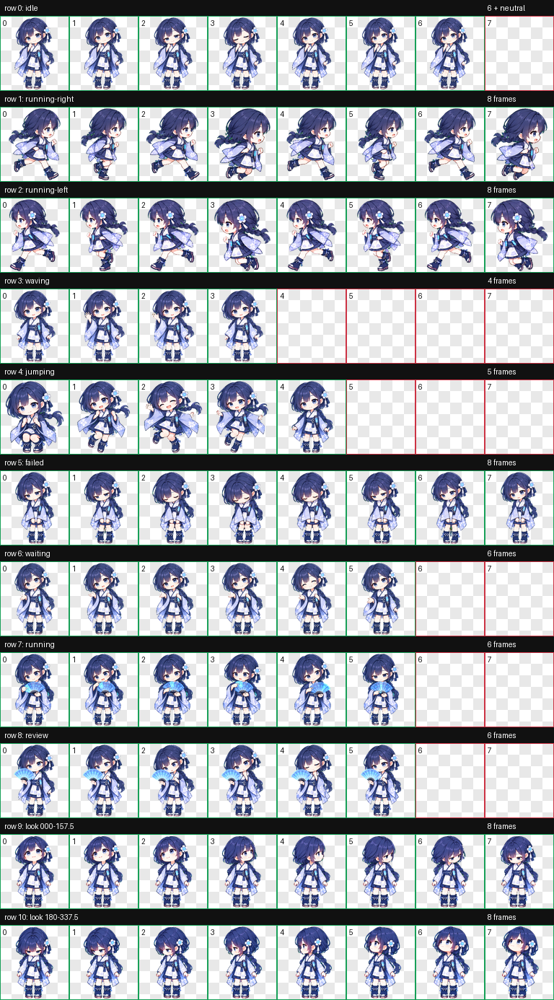

# ヒューメア（Humea）— Codex custom pet

和風の装いと透明なサイバー扇子を組み合わせた、Codex用のオリジナルSDペットです。



## 収録ファイル

```text
humea/
├── pet.json             # Codexが読むマニフェスト
├── spritesheet.webp     # v2スプライト（1536×2288、8列×11行）
├── preview.png          # 全アクション確認用
├── README.md
└── qa/                  # 検証結果と16方向確認画像
```

Codexが実行時に必要とするのは `pet.json` と `spritesheet.webp` の2ファイルです。`preview.png`、`README.md`、`qa/` はバックアップ・確認用で、そのまま同じフォルダに置いても問題ありません。

## Codexへ設定する — 画面操作

1. Codex Desktopを開き、`Settings` → `Personalization` → `Pets` を開きます。日本語UIでは表示名が多少異なる場合があります。
2. `Custom pets` の `Open folder` を押して、カスタムペット用フォルダをFinderで開きます。
3. この `humea` フォルダを丸ごと、開いたフォルダ直下へコピーします。次の配置になっていることを確認します。

   ```text
   pets/
   └── humea/
       ├── pet.json
       └── spritesheet.webp
   ```

4. Codexへ戻り、`Refresh` を押します。
5. `Pick a pet` で `Humea` を選び、`Wake Pet` を押します。コマンドメニューの `Show pet` でも表示できます。
6. 読み込まれない場合はCodexを完全終了して再起動し、もう一度 `Refresh` を押します。

## Codexへ設定する — ターミナル

このリポジトリ／フォルダのルートで実行します。

```bash
HUMEA_DEST="${CODEX_HOME:-$HOME/.codex}/pets/humea"
mkdir -p "$HUMEA_DEST"
cp pet.json spritesheet.webp "$HUMEA_DEST/"
```

その後、Codexの `Settings` → `Personalization` → `Pets` で `Refresh` を押し、`Humea` を選択します。既存の同名ペットを残したい場合は、上のコピー前に `${CODEX_HOME:-$HOME/.codex}/pets/humea` を別名でバックアップしてください。

## GitHubへバックアップする — GitHub CLI

この環境では `git` と `gh` が利用できます。非公開リポジトリを推奨します。

```bash
cd /path/to/humea
git init -b main
git add .
git commit -m "Add Humea Codex pet"
gh auth status
gh repo create humea-codex-pet --private --source=. --remote=origin --push
```

`gh auth status` が未ログインを示した場合は、`gh auth login` を先に実行します。

## GitHub CLIを使わない場合

1. GitHub上で `humea-codex-pet` という空のPrivateリポジトリを作成します。READMEや`.gitignore`の自動追加はオフにします。
2. ローカルの `humea` フォルダで次を実行します。`USERNAME` は自分のGitHubユーザー名へ置き換えます。

```bash
cd /path/to/humea
git init -b main
git add .
git commit -m "Add Humea Codex pet"
git remote add origin git@github.com:USERNAME/humea-codex-pet.git
git push -u origin main
```

SSHを設定していない場合は、remote URLを `https://github.com/USERNAME/humea-codex-pet.git` にします。

## 別のMacへ復元する

```bash
git clone git@github.com:USERNAME/humea-codex-pet.git humea
cd humea
HUMEA_DEST="${CODEX_HOME:-$HOME/.codex}/pets/humea"
mkdir -p "$HUMEA_DEST"
cp pet.json spritesheet.webp "$HUMEA_DEST/"
```

Codexで `Refresh` → `Humea` → `Wake Pet` の順に選びます。

## 検証情報

- Codex sprite contract: v2
- Atlas: 1536×2288 px
- Grid: 8 columns × 11 rows
- Cell: 192×208 px
- Transparent background: verified
- Used/unused cells and chroma edges: verified
- Standard actions: idle, running-right, running-left, waving, jumping, failed, waiting, running, review
- Look directions: 16 directions at 22.5° intervals

詳細は `qa/validation.json`、`qa/final-visual-qa.json`、`qa/direction-semantics.json` を参照してください。

スプライトが破損していないか確認する場合は、フォルダ直下で次を実行します。

```bash
shasum -a 256 -c SHA256SUMS
```
